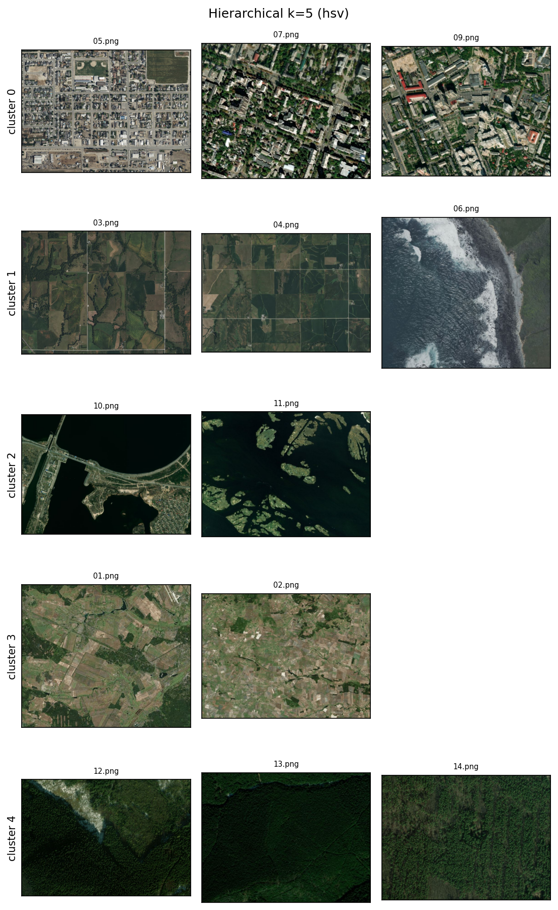
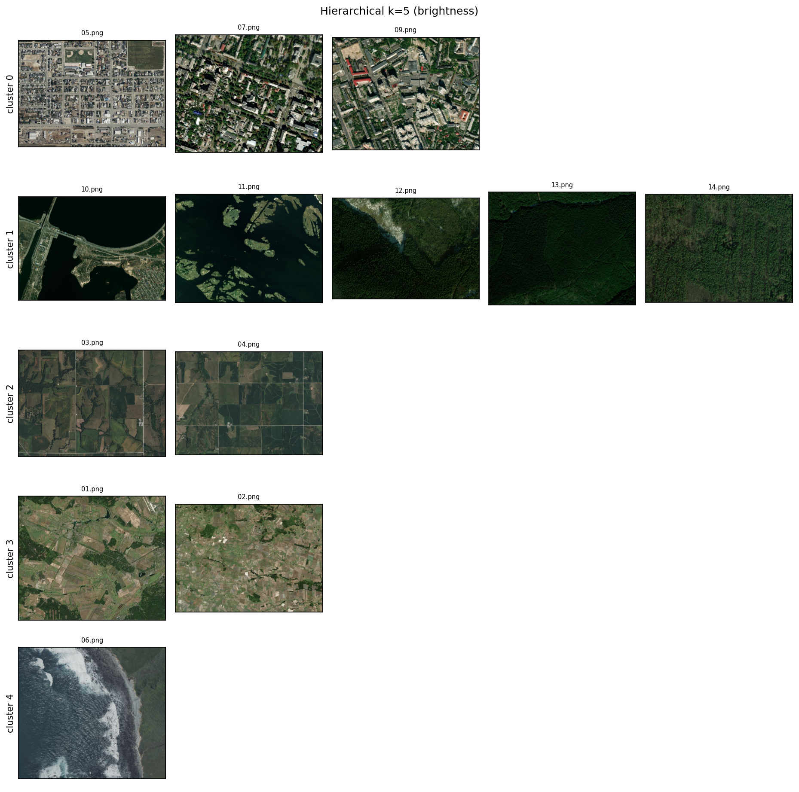

# Clustering of Remote-Sensing (ДЗЗ) Images — ГРУПА ВИМОГ 2

Cluster a set of Earth-surface remote-sensing images by visual features using
classical ML clustering. **No deep learning.** Full pipeline in
`experiments.ipynb`; saved figures in `results/`.

## 1. Data

13 screenshots in `data/raw/`. They span roughly 6 land-cover
types — urban, rural patchwork, agricultural fields, forest, rivers/lakes — plus one deliberately added outlier (an ocean coast scene) to
test how the methods handle an anomaly.

## 2. Approach

**Two feature sets**, each turned into a fixed-length, L1-normalized vector per
image (L1 makes them independent of image size):

- **Brightness histogram**  — one histogram over all pixel
  intensities (48 bins). Captures lightness only, no color.
- **HSV color histogram** — per-channel H/S/V histograms (16 bins each),
  concatenated → 48-D. Separates color (hue) from brightness.

Both are standardized with `StandardScaler` before clustering.

**Choosing `k`:**
- **KMeans** — `k` selected by the **silhouette score** over `k = 2..7` (the
  value with the best-separated clusters).
- **Hierarchical** — `k` read from the **dendrogram**, cutting at the largest
  vertical gap between merges. The dendrogram suggested `k = 3`, which visually
  groups the images mostly by color; testing `k = 5` gave better semantic
  separation, so `k = 5` was used.

**Algorithms tried:** KMeans, hierarchical (agglomerative), DBSCAN.

## 3. Results

**Feature choice matters more than the algorithm.**

- **HSV color — best.** The only feature that separates **water from forest**:
  both are dark, but HSV distinguishes blue from green. Cleanest semantic groups.
- **Brightness — weaker baseline.** Color-blind by construction, so it merges
  all dark scenes (water + forest) into a single "dark" cluster.

**Algorithm comparison.** KMeans and hierarchical produced nearly identical
groupings on the same features. **DBSCAN** was unsuited to so few, sparse points and failed to
form sensible clusters.

**Outlier handling.** KMeans and hierarchical cannot label an outlier — with a
fixed `k` they must assign every image somewhere, so the coast scene either
became its own singleton cluster (when `k` allowed) or was absorbed into the
nearest group. A native "noise" label (DBSCAN) is the right tool for outliers
but needs more data to work reliably.

**Recommended pipeline:** HSV color histogram → `StandardScaler` → hierarchical
clustering at `k ≈ 5`.

## 4. Best solutions


**Hierarchical (HSV)**



**KMeans (HSV)**




## Setup

```bat
python -m venv venv
venv\Scripts\activate.bat
pip install -r requirements.txt
```
